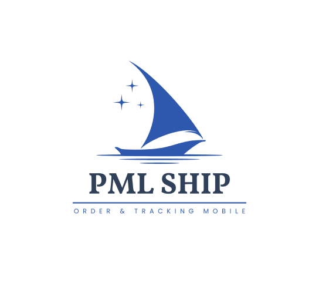

# Tugas Akhir Teknik Elektro Universitas Diponegoro
<!-- PROJECT LOGO -->
 

  

  <h3 align="center">PML-SHIP</h3>

  

    Ship e-commerce through mobile apps.
     
    <a href="https://github.com/danisefianto/PML-SHIP">
     
     
    <a href="https://github.com/danisefianto/PML-SHIP">View Demo</a>
    ·
    <a href="https://github.com/danisefianto/PML-SHIP/issues">Report Bug</a>
    ·
    <a href="https://github.com/danisefianto/PML-SHIP/issues">Request Feature</a>
  

<!-- TABLE OF CONTENTS -->

  
Table of Contents

  <ul>
    <li>
      <a href="#about-the-project">About The Project</a>
      <ul>
        <li><a href="#technology-used">Technology Used</a></li>
      </ul>
    </li>
    </li>
    <li><a href="#team-member">Team Member</a></li>
    <li><a href="#acknowledgments">Acknowledgments</a></li>
  </ul>

# About The Project
As a shipping company, [PT Patria Maritime Lines](https://pml.co.id/) experiences difficulties in managing customer orders. Previously customer orders came via telephone or email. It is hoped that the PML-SHIP application can move customer orders from telephone/email to ordering via the application.

# Technology Used
1. Android
    - [Flutter](https://flutter.dev/) 3.19.3
2. Backend
    - [Laravel](https://laravel.com/)
3. Design
    - [Figma](https://www.figma.com/)

# Resource
1. Use Case Diagram
2. Activity Diagram
3. Sequence Diagram
4. UI/UX (Figma)
    - User Flow
    - Information Architecture (IA)
    - Wireframe/Low-Fidelity Prototype
    - Mockup/High-Fidelity Prototype
    - Prototype (Clickable)

# Team Member
## Team ID / Document Number: 837
| Name | Student ID | Contact |
| --- | --- | --- |
| FADHIL PRAWIRA | 21060120140057 |   |
| DANI SEFIANTO | 21060120120024 |   |
| QORY WILJANOVA | 21060120140110 |   |

<!-- reference https://github.com/alexandresanlim/Badges4-README.md-Profile -->

# Contributing
We are very open to any input, therefore we want to make contributing to this project as easy and transparent as possible, whether it's:

- Reporting a bug
- Discussing the current state of the code
- Submitting a fix
- Proposing new features
- Becoming a maintainer

If you think something important is missing or should be different based on your experience, we'd love to have you contribute to this project. If you have suggestions for improving these apps, please [contact](https://github.com/danisefianto/PML-SHIP#team-member) the existing ones.

# Acknowledgments
||
|:--:|
|**Departemen Teknik Elektro Universitas Diponegoro**|

||
|:--:|
|**PT Patria Maritime Lines**|